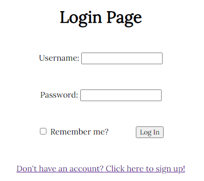
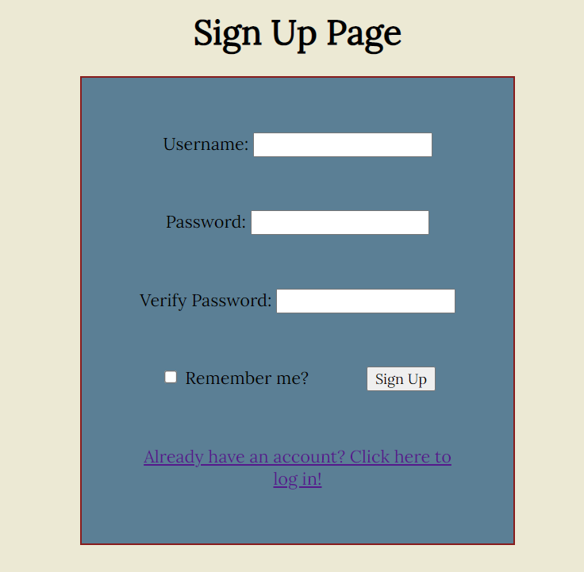
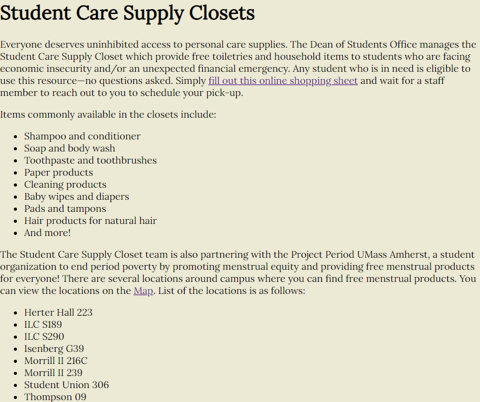
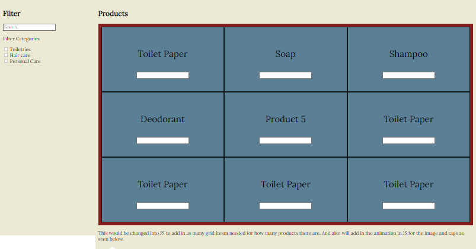
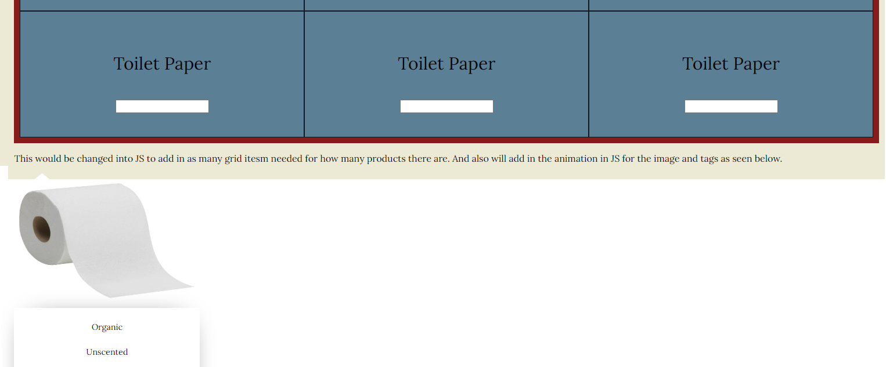
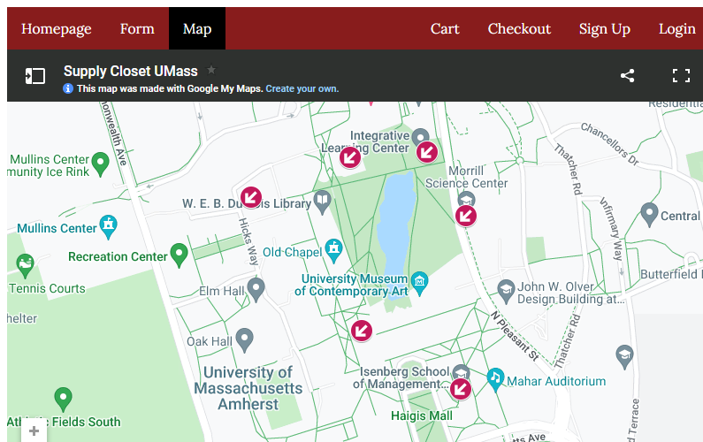

**Title: Clockwork**
---
**Subtitle: Kloseted supply**
---
**Semester: Spring 2022**
---

# Overview: 

A brief overview of your application. This will be based on what you are submitting as your final web application artifact. You should also mention why your application is innovative.

# Team Members:

|No.          | Name      | Github Username |
| ----------- | ----------- | ----------- |
|1.           | Rajasi Desai      | Rajasi-Desai       |
|2.           | Grace Chang   | gracec4227        |
|3.           | Isi Bernoff   | isi-bernoff        |
|4.           | Aryan Mangalik   | amangalik       |

# User Interface: 
A final up-to-date list/table describing your application’s user interface. This should include the name of the UI view and its purpose. You should include a screenshot of each of your UI views.

### Page to login

### Sign up page

### Homepage with all information

### Product page

### Product page with the drop down cart

### Checkout page

### Map page to find locations

# APIs: 
A final up-to-date list/table describing your application’s API

# Database: 
A final up-to-date representation of your database including a brief description of each of the entities in your data model and their relationships if any.

# URL Routes/Mappings: 
A final up-to-date table of all the URL routes that your application supports and a short description of what those routes are used for. You should also indicate any authentication and permissions on those routes.

## User endpoints

### Login
1. `/user/register?username=<username>&password=<password>`: Register new user
2. `/user/login`: Login existing user
3. `/user/id/update?password=<new_password>`: Update user's password

### Cart
1. `/user/id/cart/add?item=<item_name>` : To add the item to the user's cart
2. `/user/id/cart/increment?item=<item_name>` : To increment the item in the user's cart
3. `/user/id/cart/decrement?item=<item_name>` : To decrement the item in the user's cart
4. `/user/id/cart/delete?item=<item_name>` : Completely removes an item from the user's cart
5. `/user/id/cart/empty` : Removes all items from the user's cart

### Checkout
1. `/user/id/checkout/view`: Allows user to view items and checkout
2. `/user/id/cart`: Allows user to view their cart

## Admin endpoints

### Item
1. `/item/id/view`: Allows for viewing a item which will self contain it's tag information, quantity, and description
2. `/item/id/update?quantity=<value>`: Allows to update an item's quantity
3. `/item/id/update?tag=<value>` : Allows to update the item's tags.
4. `/item/id/update?description=<value>`: Allows to update an item's description
5. `/item/create?name=<item_name>&quantity=<quantity>&tag=<tag_values>&description=<desc_value>`: Allows for creating an item for the database.
6. `/item/id/delete` : Deletes the item from the database

# Authentication/Authorization: 
A final up-to-date description of how users are authenticated and any permissions for specific users (if any) that you used in your application. You should mention how they relate to which UI views are accessible.

# Division of Labor:

### Rajasi: 

### Grace: 

### Isi:

### Aryan:

# Conclusion: 
A conclusion describing your team’s experience in working on this project. This should include what you learned through the design and implementation process, the difficulties you encountered, what your team would have liked to know before starting the project that would have helped you later, and any other technical hurdles that your team encountered.

# Link to the hosted application:

https://final-clockwork-326.herokuapp.com/

# Link to the Video:

# Group Grading Rubric
100 points available.

## Frontend (HTML & CSS): 20 points
| Rubric Item | Description     | Points |
| Organization --- | --------------- | ----- |
| Images       |                 |       |
| ------------ | --------------- | 5 ---- |
| UI           |
| ------------ | --------------- | ------ |
* 5 points - Clean and crisp site organization
* 5 points - Images
* 10 points - UI works as indended

## JS and Site Functionality: 40 points
* 10 points - Users are able to view data
  * 5: Hover to see images and description of items
  * 5: 
* 5 points - Persistant data

## Database: 30 points
* 10 points - Data is fetched correctly 

## Authentication: 10 points
