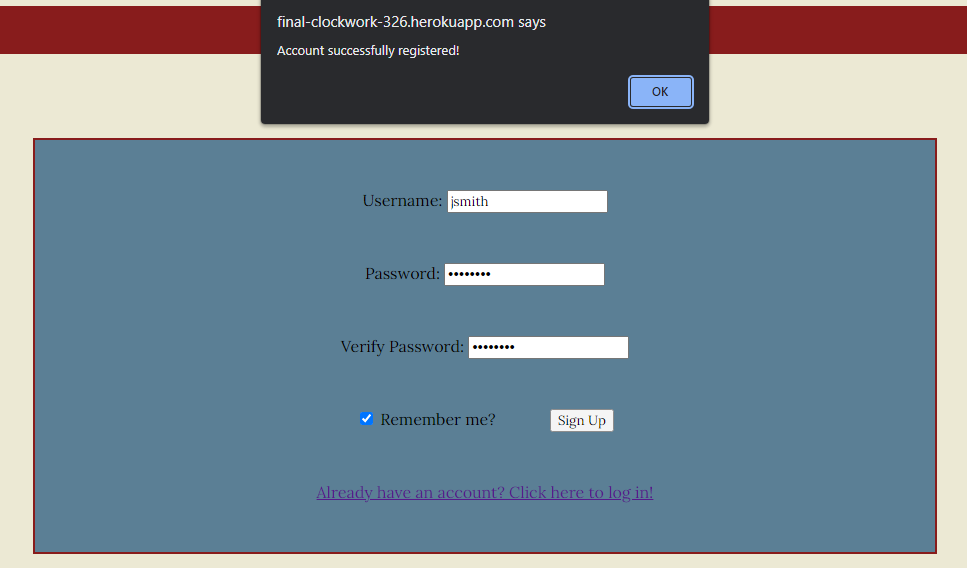

# Endpoints

We are dividing the endpoints in such a way that there are two separate parts. One is for the User and what they would want to do while shopping and the other is for the Admin so that they can change things related to stock of each product. 

## User endpoints

### Login
1. `/user/register?username=<username>&password=<password>`: Register new user
2. `/user/login`: Login existing user
3. `/user/id/update?password=<new_password>`: Update user's password

### Cart
1. `/user/id/cart/add?item=<item_name>` : To add the item to the user's cart
2. `/user/id/cart/increment?item=<item_name>` : To increment the item in the user's cart
3. `/user/id/cart/decrement?item=<item_name>` : To decrement the item in the user's cart
4. `/user/id/cart/delete?item=<item_name>` : Completely removes an item from the user's cart
5. `/user/id/cart/empty` : Removes all items from the user's cart

### Checkout
1. `/user/id/checkout/view`: Allows user to view items and checkout
2. `/user/id/cart`: Allows user to view their cart

## Admin endpoints

### Item
1. `/item/id/view`: Allows for viewing a item which will self contain it's tag information, quantity, and description
2. `/item/id/update?quantity=<value>`: Allows to update an item's quantity
3. `/item/id/update?tag=<value>` : Allows to update the item's tags.
4. `/item/id/update?description=<value>`: Allows to update an item's description
5. `/item/create?name=<item_name>&quantity=<quantity>&tag=<tag_values>&description=<desc_value>`: Allows for creating an item for the database.
6. `/item/id/delete` : Deletes the item from the database

# Front-end Implementation

### Create
The sign up page allows for the client to register themselves as a new user and add their information to the (prospective) database of users.

### Read
The login page will allow an existing user to log in or out. An `alert()` message will tell the user if their login details are invalid.

### Update
The products page allows the client to update the items that are currently in their cart, whether it is adding new items or adjusting the quantities of existing items.

### Delete
The checkout page will allow the user to review and submit their final order. Clicking the <kbd>&check;Checkout</kbd> button will alert the user that their order has been placed, and clicking the <kbd>&cross;Empty</kbd> button will empty/delete the contents of the user's cart.

# Deployment

Link to the hosted application:

 https://final-clockwork-326.herokuapp.com/

# Contribution

### Rajasi: 
I worked on the cart implementation and worked on mostly the server side setting up the endpoints. I also worked on deploying the site on Heroku and creating the markdown templates.

### Grace: 
I worked on changing the product/form page into JS and mainly worked on additional features such as filtering the products and creating a pop out image for each product.

### Isi:
I standardized the custom datatypes for `User`s, `Cart`s, and `Item`s and implemented checkout functionality.

### Aryan:
I implemented the login and signup pages using JS, allowing the user to both register a new account and log in to access their cart and make orders. I also edited each page to allow the user to log out from any page.
